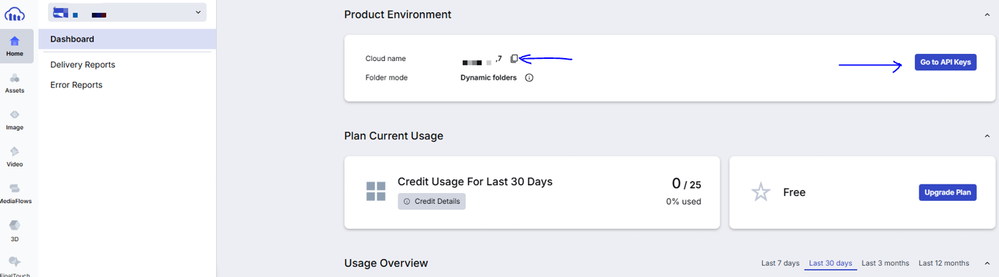
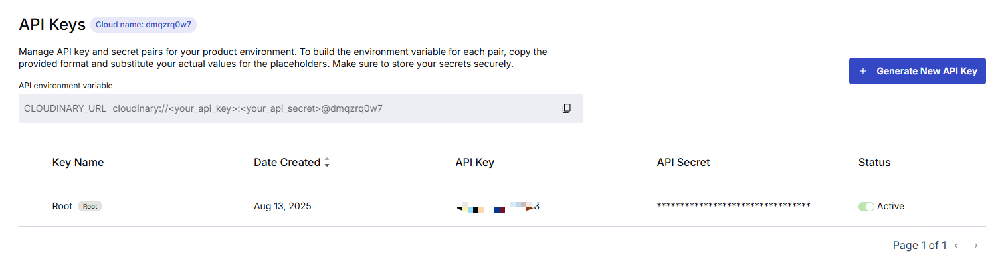
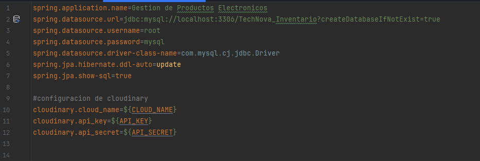
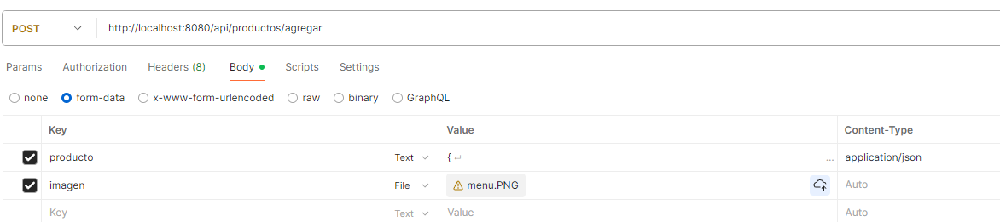

# API INVENTARIO
Es una API sencilla donde pruebo el servicio de Cloudinary para subir las imagenes de los productos
## Nota 
 - Recuerda tener una cuenta en cloudinary para que puedas probar la subida de imagenes -> https://cloudinary.com/
### Como usar cloudinary
- Registrate
- Guarda el CloudName y dirigete a API Keys
  
- Guarda el API Key y el API SECRET
  
- Pega cada uno en las variables de entorno
  

## 🚀Tecnologias Usadas
 - Java 21 / Spring Boot 3
 - Spring Data JPA
 - MySQL
 - Lombok
## Entidades
### Productos 
  - idProducto
  - nombre
  - descripcion
  - urlImagen
  - categoria (FK)
  - precio
  - stock
  - maxStock
  - dimensiones
  - modelo
### Modelo
  - idModelo
  - nombreModelo
### Categoria
  - idCategoria
  - nombreCategoria

## Intruccion Postman
Para que no tengas problemas al mandar un producto y su imagen. Seleccion en Body form-data y agrega application/json en Content Type del producto

